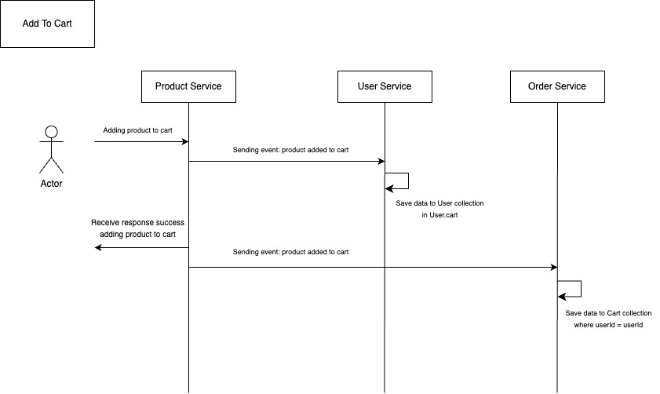
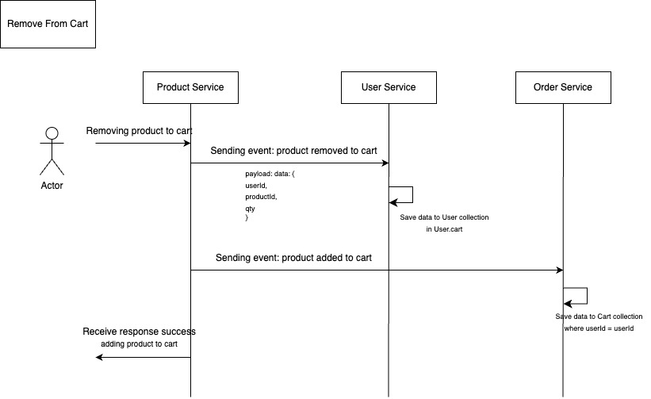

## Overview

E-Commerce NodeJS MS adalah aplikasi berbasis microservices untuk mensimulasikan proses belanja di sebuah e-commerce yang terdiri dari 4 service:
1. User Service
2. Product Service
3. Order Service
4. Transaction Service

Communication between services are illustrated with diagram below:

#### Adding items to cart:


#### Removing items from cart:


#### Creating order from cart items


#### Payment Transaction for an Order


#### Canceling a Transaction


## Data Modeling
Masing-masing service memiliki satu atau lebih database collection yang dikelolanya.

1. User Service memiliki data collection Users
2. Product Service memiliki data collection Products
3. Order Service memiliki data collection Carts dan Orders
4. Transaction Service memiliki data collection Transactions

Entity Diagram untuk keempat service tersebut dapat dilihat di bawah ini:


## How to Use

### How to run individual services
1. Clone repo
2. Copy `.env.dev` to `.env`
3. Ensure MongoDB & Kafka is available in the system, and update `.env` file accordingly
4. Change directory into individual service's directory, e.g: `cd user`
4. Run `npm run dev`

### How to run overall project
1. Install Docker Engine
2. HOST_IP is needed to run Kafka properly. Provide HOST_IP in ENV file, then run docker-compose:
```
docker-compose build && docker-compose up
```

or get current HOST_IP directly from command:

```
export HOST_IP=$(ifconfig | grep -E "([0-9]{1,3}\.){3}[0-9]{1,3}" | grep -v 127.0.0.1 | awk '{ print $2 }' | cut -f2 -d: | head -n1)
docker-compose build && docker-compose up
```

## How to Test
`npm run test`

## API Documentation
API Documentation is provided with Postman [Click here to access](https://documenter.getpostman.com/view/3500918/2s9YeK3pdW)
